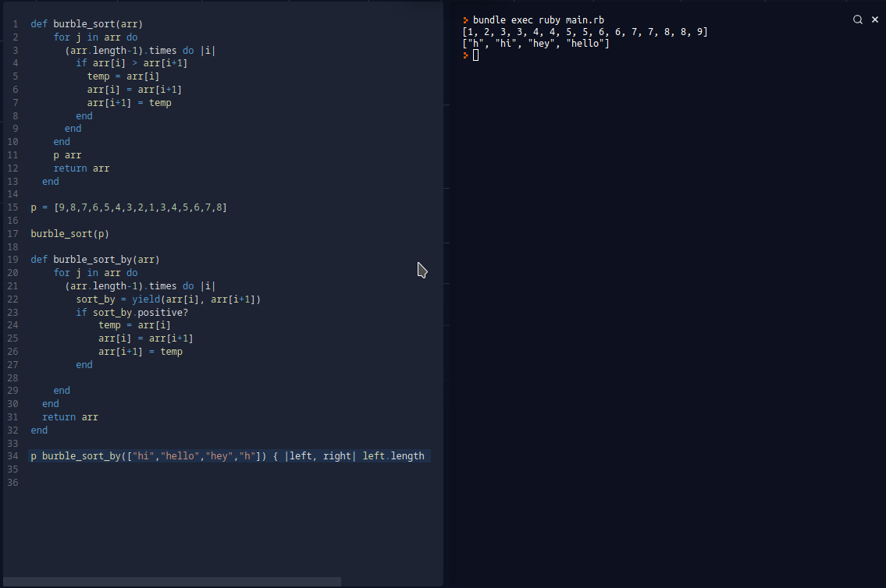

# Enumerables

> This project shows enumerable methods of integer, nil and string arrays, ranges and hashes.

This is our 1st ruby project in microverse

## Built With

- Ruby

## Live Demo

https://replit.com/@vikitaotiz/HandyNotedTrees#main.rb

## Getting Started

1. Clone the project
   https://github.com/igorkol91/bubbleSort/tree/development
2. On your terminal, cd into the app directory
3. Run "ruby enumerable.rb"

4. You can also copy the code from enumerable.rb then paste and run it on https://replit.com/languages/ruby

### Prerequisites

For local usage, ensure you have ruby installed and environment configured

## Authors

:bust_in_silhouette: **Author1**

- GitHub: [@igorkol91](https://github.com/igorkol91)
- Twitter: [@Destro49536502]
- LinkedIn: [LinkedIn](https://linkedin.com/in/linkedinhandle)

:bust_in_silhouette: **Author2**

- GitHub: [@vikitaotiz](https://github.com/vikitaotiz)
- Twitter: [@victoro29641869]
- LinkedIn: [LinkedIn](https://linkedin.com/in/linkedinhandle)

## :handshake: Contributing

Contributions, issues, and feature requests are welcome!
Feel free to contribute

## Show your support

Give a ⭐️ if you like this project!
